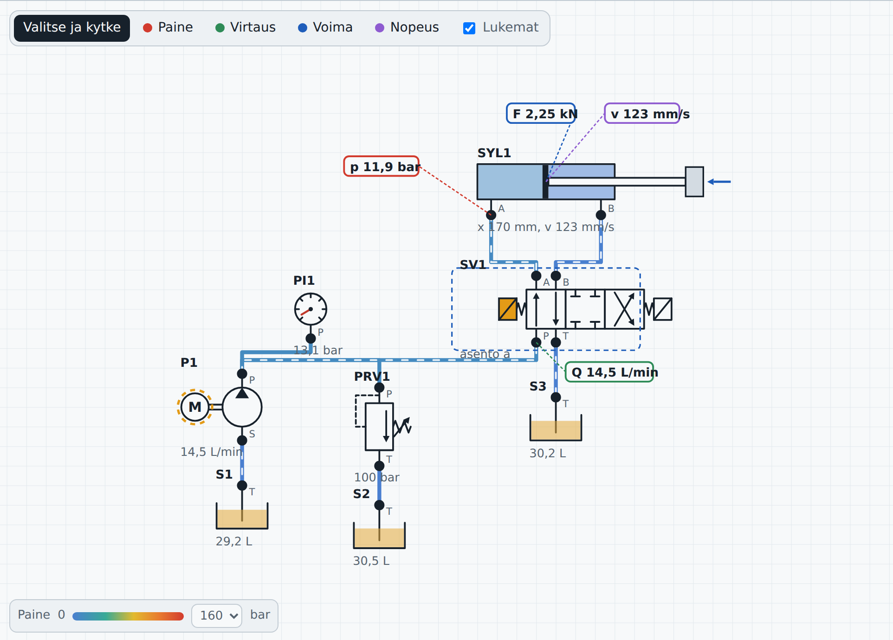
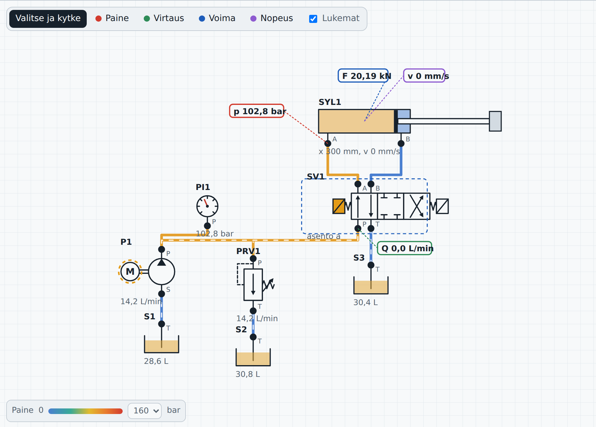
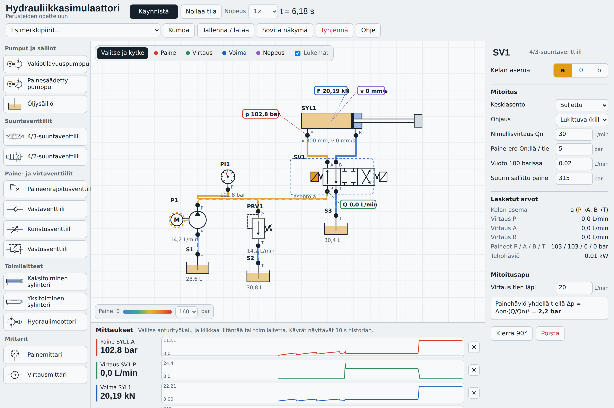

# Hydrauliikkasimulaattori – käyttöohje

Juho Pirttilahti, Seinäjoen ammattikorkeakoulu (SeAMK), 2026 · CC BY 4.0

> Tämä tiedosto on käyttöohjeen versioitu kopio. Kun simulaattoriin tehdään muutoksia, päivitä tämä ohje samassa pull requestissa.

## Mikä simulaattori on

Hydrauliikkasimulaattori on selaimessa toimiva harjoitusympäristö, jossa rakennetaan hydraulipiiri ISO 1219 -tyyppisistä piirrosmerkeistä ja nähdään heti, miten paine, tilavuusvirta, voima ja nopeus käyttäytyvät. Asennusta ei tarvita, ja piiri tallentuu automaattisesti selaimeen.

Simulaattorilla voi harjoitella esimerkiksi:

- miten paineenrajoitusventtiili rajaa järjestelmän paineen ja minne pumpun tuotto menee, kun toimilaite pysähtyy
- miksi kaksitoiminen sylinteri liikkuu sisään nopeammin ja pienemmällä voimalla kuin ulos
- miten kuristus tulopuolella ja poistopuolella eroavat ja miksi poistopuolen kuristus voi nostaa rengaspuolen paineen yli järjestelmäpaineen
- miten suuntaventtiilin keskiasento vaikuttaa kuorman pitoon, pumpun kuormitukseen ja moottorin pysäytykseen
- komponenttien mitoitusta: sylinterin halkaisija voimasta, pumpun kierrostilavuus tuotosta ja moottorin kierrostilavuus väännöstä.

Simulaattori on tarkoitettu ilmiöiden ymmärtämiseen. Sen tulokset eivät korvaa järjestelmätoimittajan mitoituslaskelmia (ks. kohta Mallin rajoitukset).

## Näkymän osat

Näkymä jakautuu viiteen alueeseen. Kapealla näytöllä, kuten puhelimessa, alueet pinoutuvat allekkain ja paletti vierii vaakasuunnassa.

| Alue | Sijainti | Mitä siinä tehdään |
| --- | --- | --- |
| Yläpalkki | Ylhäällä | Käynnistä tai pysäytä simulointi, nollaa tila, valitse nopeus (1×–0,1×), lataa esimerkkipiiri, kumoa, tallenna tai lataa, sovita näkymä, tyhjennä alusta, avaa ohje. Simulaatioaika näkyy muodossa t = … s. |
| Paletti | Vasen reuna | Komponentit ryhmiteltyinä: pumput ja säiliöt, suuntaventtiilit, paine- ja virtaventtiilit, toimilaitteet, mittarit. |
| Piirtoalusta | Keskellä | Piiri rakennetaan ja simuloidaan tässä. Vasemmassa yläkulmassa on työkalurivi (Valitse ja kytke, Paine, Virtaus, Voima, Nopeus, Lukemat). Alhaalla ovat paineen väriasteikko ja varoitukset. |
| Ominaisuuspaneeli | Oikea reuna | Valitun komponentin tunnus, ohjaus, mitoitusparametrit, lasketut arvot ja mitoitusapu. Kun mitään ei ole valittu, paneeli näyttää piirin yhteenvedon ja pikaohjeen. |
| Mittauspaneeli | Alhaalla keskellä | Jokaisen anturin nykyinen lukema ja 10 sekunnin käyrä. Anturi poistetaan ✕-painikkeella. |

Piirtoalustaa siirretään vetämällä tyhjästä kohdasta ja zoomataan hiiren rullalla. Sovita näkymä tuo koko piirin ruudulle.

## Piirin rakentaminen

Piiri syntyy kolmessa vaiheessa: komponentit alustalle, letkut liitännästä liitäntään, mitoitusarvot kohdalleen.

### Komponentin lisääminen ja siirtäminen

1. Vedä komponentti paletista piirtoalustalle. Vaihtoehtoisesti klikkaa sitä, jolloin se ilmestyy näkymän keskelle.
2. Siirrä komponenttia vetämällä sen runkoa. Sijainti tarttuu 10 pikselin ruudukkoon.
3. Kierrä valittua komponenttia 90° R-näppäimellä tai ominaisuuspaneelin Kierrä 90° -painikkeella.
4. Poista valittu komponentti Delete-näppäimellä tai Poista-painikkeella. Siihen liitetyt letkut ja anturit poistuvat samalla.

### Linjojen piirtäminen

1. Varmista, että työkalurivillä on valittuna Valitse ja kytke. Jos anturityökalu on päällä, klikkaus lisää anturin eikä aloita linjaa. Esc palauttaa valintatyökalun.
2. Paina hiiren painike pohjaan liitännän pienen ympyrän päällä. Kursori muuttuu ristiksi. Jos painat rungosta, komponentti lähtee liikkumaan.
3. Vedä toisen liitännän päälle ja päästä irti. Katkoviiva näyttää kiinnityskohdan, ja noin 14 pikselin etäisyys liitännästä riittää.

Linjan reitti piirtyy automaattisesti suorakulmaisena, eikä siihen voi lisätä taitepisteitä. Reitti muuttuu, kun siirrät tai kierrät komponentteja, joten sijoita komponentit niin, että liitännät osoittavat toisiaan kohti.

- **Haara (T-liitos):** kytke toinen letku samaan liitäntään. Linjan keskelle ei voi kytkeä.
- **Tulppa:** kytkemätön liitäntä on tulpattu. Esimerkiksi 4/2-venttiilin B voi jäädä kytkemättä yksitoimisen sylinterin piirissä.
- **Kytkentätila:** kytketty liitäntä näkyy täytettynä pisteenä, kytkemätön tyhjänä ympyränä.
- **Linjan poisto:** klikkaa linjaa, jolloin se paksunee, ja paina Delete tai Poista kytkentä.
- **Kumoa:** Ctrl+Z tai Kumoa-painike peruu viimeisimmän muutoksen. Muistissa on 60 askelta.

Jos liitäntöihin on vaikea osua, zoomaa lähemmäs hiiren rullalla.

## Komponentit ja mitoitus

Paletissa on 13 komponenttia. Kun komponentti on valittuna, ominaisuuspaneelin Mitoitus-osassa muutetaan sen parametreja. Lasketut arvot päivittyvät simuloinnin aikana, ja Mitoitusapu laskee käänteisesti tarvittavan koon.

| Komponentti | Liitännät | Tärkeimmät mitoitusparametrit | Mitoitusapu |
| --- | --- | --- | --- |
| Vakiotilavuuspumppu | P, S (imu) | Vg (cm³/r), n (r/min), nimellispaine, ηv, ηhm | Vg halutusta tuotosta |
| Painesäädetty pumppu | P, S | Kuten edellä + säätöpaine | Vg halutusta tuotosta |
| Öljysäiliö | T | Tilavuus, öljymäärä alussa | – |
| 4/3-suuntaventtiili | P, T, A, B | Keskiasento (suljettu, tandem, avoin, kelluva), ohjaus (lukittuva tai jousipalautteinen), Qn ja Δp tietä kohden, vuoto | Painehäviö annetulla virtauksella |
| 4/2-suuntaventtiili | P, T, A, B | Ohjaus, Qn, Δp, vuoto. Lepoasento b: P→B, A→T | Painehäviö annetulla virtauksella |
| Paineenrajoitusventtiili | P, T | Asetuspaine, Qn, paineen nousu Qn:llä | – |
| Vastaventtiili | A → B | Avautumispaine, Qn, Δp Qn:llä | – |
| Kuristusventtiili | A, B | Avaus %, Qn täysin auki, Δp Qn:llä | Avaus % halutusta virtauksesta ja paine-erosta |
| Vastusventtiili | A, B | Kuristus A→B, vapaa virtaus B→A vastaventtiilin kautta | – |
| Kaksitoiminen sylinteri | A (mäntäpuoli), B (varsipuoli) | D, d, isku, massa, kuorma ja sen tyyppi, asento, kitka, vaimennus, alkuasema | D voimasta ja paineesta (ehdottaa vakiokokoa D/d), Q halutusta nopeudesta |
| Yksitoiminen sylinteri | A | D, isku, massa, kuorma, jousen esijännitys ja jousivakio, asento | D voimasta ja paineesta |
| Hydraulimoottori | A, B | Vg, kuormitusmomentti, hitausmomentti, kitka, ηhm, vuoto | Vg väännöstä ja paine-erosta, Q nopeudesta |
| Paine- ja virtausmittari | P / A, B | Mitta-alue | – |

Kaikilla paineenalaisilla komponenteilla on Suurin sallittu paine. Jos piirin paine ylittää sen, alustalle tulee varoitus.

**Sylinterin kuorman tyyppi** kannattaa valita tarkoituksella:

- *Vastustaa liikettä* toimii kuin kitka. Se jarruttaa sekä ulos- että sisäänajoa.
- *Vakiovoima* painaa vartta sisäänpäin, kun F on positiivinen (negatiivinen F vetää ulos). Se auttaa sisäänajossa ja voi aiheuttaa ryntäävän kuorman ja kavitaation.
- *Pysty, ulosajo ylös* lisää painovoiman m·g, joka vastustaa ulosajoa ja laskee kuorman, kun A-puoli avataan säiliöön.

Mitoitusavun kaavat:

$$D = \sqrt{\frac{4F}{\pi p}} \qquad V_g = \frac{Q \cdot 1000}{n \cdot \eta_v} \qquad V_g = \frac{20\pi T}{\Delta p \cdot \eta_{hm}}$$

Yksiköt: D (m), F (N), p (Pa); Vg (cm³/r), Q (L/min), n (r/min); T (Nm), Δp (bar).

## Simuloinnin ajaminen ja ohjaus

Simulointi käynnistyy itsestään, kun sivu avataan, ja laskee reaaliajassa. Piiriä voi muokata simuloinnin pyöriessä: uusi kytkentä tulee voimaan heti.

- **Käynnistä / Pysäytä** (tai välilyönti) jäädyttää ajan. Lukemat ja käyrät jäävät näkyviin tarkastelua varten.
- **Nopeus** 0,5×, 0,2× tai 0,1× hidastaa nopeita tapahtumia, kuten painepiikkiä sylinterin osuessa päätyyn.
- **Nollaa tila** asettaa paineet nollaan, sylinterit alkuasemaansa, säiliöt alkutäyttöön ja tyhjentää käyrät. Piiri ja mitoitus säilyvät.

**Suuntaventtiilin ohjaus.** Klikkaa venttiilin kelaa, eli piirrosmerkin päädyssä olevaa vinoviivallista laatikkoa. Vasen kela vaihtaa asentoon a (P→A, B→T), oikea asentoon b (P→B, A→T). Aktiivinen kela näkyy oranssina, ja venttiilin ruudut liukuvat niin, että käytössä oleva ruutu on liitäntöjen kohdalla. Asennon voi valita myös ominaisuuspaneelin painikkeista a, 0 ja b.

- *Lukittuva:* kela pysyy päällä, kunnes klikkaat sitä uudelleen.
- *Jousipalautteinen:* kela on päällä vain niin kauan kuin pidät hiiren painiketta pohjassa, ja jousi palauttaa venttiilin keskiasentoon tai 4/2-venttiilillä lepoasentoon b.

**Pumpun ohjaus.** Klikkaa pumpun sähkömoottoria M tai paneelin painiketta. Käyvän moottorin ympärillä pyörii oranssi katkoviiva. Pumpun pyörimisnopeus nousee käynnistyksessä noin 0,1 sekunnissa.

**Kuristimen avaus** säädetään ominaisuuspaneelin liukusäätimellä, ja muutos näkyy nopeudessa välittömästi.

## Mittaukset ja anturit

Mittaustietoa saa neljällä tavalla: anturit, mittarikomponentit, letkujen värit ja hiiren alla näkyvä pikalukema.

### Anturit (probe-työkalut)

Valitse työkaluriviltä anturi ja klikkaa kohdetta. Anturin lappu ilmestyy piirrokseen ja sen käyrä mittauspaneeliin. Lapun voi siirtää vetämällä.

| Anturi | Kiinnitetään | Näyttää | Yksikkö |
| --- | --- | --- | --- |
| Paine (p) | Liitäntään (myös letkun päähän tai komponenttiin lähimpään liitäntään) | Liitännän paine | bar |
| Virtaus (Q) | Liitäntään | Tilavuusvirta liitännän läpi. Positiivinen = virtaa komponenttiin sisään. | L/min |
| Voima (F) | Sylinteriin | Hydraulinen voima pA·A − pB·(A − a). Positiivinen työntää ulos. | kN |
| Voima (T) | Moottoriin | Vääntömomentti | Nm |
| Nopeus (v) | Sylinteriin | Männän nopeus. Positiivinen = ulosajo. | mm/s |
| Nopeus (n) | Moottoriin | Pyörimisnopeus | r/min |

Käyrä näyttää 10 sekunnin historian ja skaalautuu automaattisesti. Asteikon ylä- ja alaraja näkyvät käyrän vasemmassa reunassa. Anturi poistetaan mittauspaneelin ✕-painikkeella.

### Muut lukemat

- **Letkun väri** kertoo paineen: sininen on matala, vihreä ja keltainen keskitaso, punainen lähellä asteikon maksimia. Maksimin (100, 160, 250 tai 400 bar) voi vaihtaa alanurkan valitsimesta. Violetti tarkoittaa alipainetta.
- **Liikkuva katkoviiva** letkussa näyttää virtauksen suunnan, ja sen nopeus kasvaa virtauksen mukana. Paikallaan pysyvä yhtenäinen viiva = ei virtausta.
- **Lukemat**-valinta näyttää jokaisen komponentin alla lyhyen lukeman, kuten sylinterin aseman ja nopeuden, pumpun tuoton tai venttiilin asennon.
- **Hiiren vieminen** liitännän tai letkun päälle näyttää hetkellisen paineen ja virtauksen.
- **Painemittari** ja **virtausmittari** ovat piirin komponentteja. Ne sopivat, kun mittaus halutaan näkyviin piirustukseen kuten oikeassa koneessa.
- **Sylinterin kammiot** värjäytyvät paineen mukaan, joten paine-ero A- ja B-puolen välillä näkyy suoraan piirrosmerkistä.

## Esimerkkikaavio: kaksitoiminen sylinteri ja 4/3-venttiili

Esimerkkipiiri 1 on hydrauliikan peruspiiri: pumppu syöttää 14,5 L/min, paineenrajoitusventtiili rajaa paineen 100 bariin, ja 4/3-venttiili ohjaa Ø50/28-sylinteriä, jonka kuormana on 2 kN. Lataa se yläpalkin valikosta Esimerkkipiirit → 1.

### Piirin osat

| Tunnus | Komponentti | Tehtävä piirissä |
| --- | --- | --- |
| P1 | Vakiotilavuuspumppu 10 cm³/r, 1450 r/min | Tuottaa noin 14,5 L/min. Imee säiliöstä S1. |
| PRV1 | Paineenrajoitusventtiili, asetus 100 bar | Avautuu, kun pumpun tuotolle ei ole muuta reittiä, ja johtaa öljyn säiliöön S2. |
| PI1 | Painemittari | Näyttää painelinjan paineen. |
| SV1 | 4/3-suuntaventtiili, suljettu keskiasento | Ohjaa öljyn sylinterin A- tai B-puolelle. Paluu säiliöön S3. |
| SYL1 | Kaksitoiminen sylinteri Ø50/28, isku 300 mm | Toimilaite. Kuorma 2000 N vastustaa liikettä. |

Piirissä on valmiina neljä anturia: paine SYL1:n A-liitännässä, virtaus SV1:n P-liitännässä sekä SYL1:n voima ja nopeus.

### Vaihe 1: lepotila

Kun SV1 on keskiasennossa, P-liitäntä on suljettu, joten pumpun koko tuotto menee PRV1:n kautta säiliöön. PI1 näyttää noin 103 bar, ja PRV1:n lukema on noin 14 L/min. Painelinja on oranssi ja PRV1:n paluulinja sininen, jossa katkoviiva liikkuu säiliöön päin. Tämä on lepotilan häviöteho: noin 2,4 kW muuttuu lämmöksi, minkä näet valitsemalla PRV1:n.

### Vaihe 2: ulosajo (kela a)

Klikkaa SV1:n vasenta kelaa. Kela muuttuu oranssiksi ja vasen ruutu, jossa nuolet ovat suoraan ylös ja alas, liukuu liitäntöjen kohdalle: P→A ja B→T.

Kuvassa näkyy:

1. **Paine laskee kuorman mukaiseksi.** A-puolella on 11,9 bar, koska paine määräytyy kuormasta eikä pumpusta: 2 kN kuorma ja kitka jaettuna männän pinta-alalla 19,6 cm² vastaa noin 11–12 baria. Kaikki letkut ovat sinisiä eli matalassa paineessa.
2. **Koko tuotto menee sylinteriin.** SV1:n P-liitännän virtaus on 14,5 L/min, ja PRV1 on kiinni (sen lukema palaa asetusarvoon 100 bar).
3. **Nopeus tulee tuotosta ja pinta-alasta.** v = Q / A = 14,5 L/min / 19,6 cm² ≈ 123 mm/s, sama kuin nopeusanturissa.
4. **Voima-anturi** näyttää 2,25 kN, eli kuorman ja kitkan summan.
5. **Virtauksen suunta** näkyy katkoviivoista: painelinjassa pumpulta venttiilille ja sylinterin A-puolelle, B-puolelta venttiilin kautta säiliöön S3.
6. **Sylinterin kammiot** ovat lähes samanvärisiä, koska paine-ero on pieni.

### Vaihe 3: sylinteri päädyssä

Kun mäntä saavuttaa 300 mm iskun pään, öljyllä ei ole minne mennä, joten paine nousee PRV1:n avautumispaineeseen.

1. **Paine nousee järjestelmäpaineeseen.** A-puolen paine on 102,8 bar ja letkut ovat oransseja. 100 barin asetuksen päälle tulee 2,8 bar, koska PRV1 tarvitsee paineen nousua läpäistäkseen 14 L/min.
2. **Voima on suurin mahdollinen.** 102,8 bar × 19,6 cm² = 20,2 kN, sama kuin voima-anturissa. Tämä on sylinterin työntövoima tällä painetasolla.
3. **Nopeus on nolla ja P-virtaus on 0 L/min.** Koko tuotto kiertää PRV1:n kautta säiliöön S2, mikä näkyy PRV1:n lukemasta (14,2 L/min).
4. **Käyrät** mittauspaneelissa näyttävät porrastuksen: paine pysyy matalana liikkeen ajan ja hyppää ylös pysähdyksessä, samalla kun nopeus putoaa nollaan.

### Vaihe 4: sisäänajo (kela b)

Klikkaa oikeaa kelaa. Ristikkäiset nuolet tulevat liitäntöjen kohdalle: P→B ja A→T. Sylinteri ajaa sisään noin 178 mm/s, eli nopeammin kuin ulos, koska rengaspinta-ala (13,5 cm²) on männän pinta-alaa pienempi. Samasta syystä suurin vetovoima jää noin 14 kN:iin.

### Koko näkymä

Oikean reunan ominaisuuspaneelissa on valittuna SV1: kelan asema a, mitoitusarvot ja lasketut arvot. Alhaalla mittauspaneeli piirtää jokaisen anturin käyrän.

## Muut esimerkkipiirit ja harjoitustehtävät

Esimerkkipiirit ladataan yläpalkin valikosta. Lataus korvaa nykyisen piirin, mutta Kumoa palauttaa sen.

| Esimerkki | Mitä tehdään | Mitä pitäisi nähdä |
| --- | --- | --- |
| 2. Nopeudensäätö poistopuolelta (meter-out) | Klikkaa SV1:n vasenta kelaa. | Sylinteri ajaa ulos noin 65 mm/s, vaikka vapaa nopeus olisi 123 mm/s. Pumpun ylimääräinen tuotto menee paineenrajoitusventtiilin kautta säiliöön, joten A-puolella on noin 101 bar. B-puolella paine nousee noin 123 bariin, eli yli järjestelmäpaineen, koska rengaspinta on männän pintaa pienempi. Sisäänajo kulkee vastaventtiilin kautta täydellä nopeudella. |
| 3. Hydraulimoottori ja virtausmittari | Klikkaa SV1:n kelaa a tai b. | Moottori pyörii noin 700 r/min kumpaankin suuntaan, ja A-puolen paine on noin 67–76 bar (20 Nm kuorma). Tandem-keskiasennossa moottori pysähtyy ja pumppu kierrättää öljyn lähes paineettomana säiliöön. |
| 4. Yksitoiminen pystysylinteri, hallittu lasku | Klikkaa 4/2-venttiilin kelaa päälle ja uudelleen pois. | Nosto noin 190 mm/s noin 15 barin paineella (150 kg kuorma). Laskussa A-puoli avautuu säiliöön ja kuristin rajoittaa laskunopeuden noin 120 mm/s:iin. Ilman kuristinta kuorma putoaisi lähes vapaasti. |

### Harjoitustehtäviä

1. Laske esimerkissä 1 sylinterin ulos- ja sisäänajonopeus käsin pumpun tuotosta. Tarkista tulos nopeusanturilla.
2. Vaihda esimerkin 1 venttiilin keskiasennoksi tandem. Mitä tapahtuu paineenrajoitusventtiilin läpi menevälle virtaukselle ja pumpun tehontarpeelle keskiasennossa?
3. Nosta esimerkin 1 sylinterin kuorma 25 kN:iin. Miksi sylinteri ei liiku ulos? Mitoita Mitoitusavulla uusi sylinteri ja kokeile.
4. Vaihda esimerkin 2 kuristus tulopuolelle (A-linjaan) ja vertaa B-puolen painetta poistopuolen kuristukseen.
5. Poista esimerkistä 4 kuristin ja kytke venttiili suoraan sylinteriin. Seuraa laskunopeutta ja A-puolen painetta laskun aikana.
6. Vaihda esimerkin 1 pumppu painesäädetyksi (säätöpaine 90 bar). Mitä tapahtuu paineenrajoitusventtiilin virtaukselle sylinterin ollessa päädyssä?

## Varoitukset, tallennus ja rajoitukset

### Varoitukset ja vianetsintä

Varoitukset näkyvät piirtoalustan alareunassa punareunaisina laatikoina.

| Varoitus | Syy | Korjaus |
| --- | --- | --- |
| Paine ylittää sallitun | Liitännän paine on yli komponentin Suurin sallittu paine -arvon. | Laske paineenrajoitusventtiilin asetusta tai valitse kestävämpi komponentti. |
| Pumppu ei saa öljyä | Pumpun imuliitäntä S on kytkemättä tai tukossa. | Kytke S säiliön T-liitäntään. |
| Alipaine (kavitaatio) | Jonkin verkon paine on painunut alle −0,95 bar, esimerkiksi ryntäävä kuorma tai jarruttava moottori. | Lisää vastapaine, kuristus poistopuolelle tai täyttölinja. |
| Paine karkaa | Vakiotilavuuspumpun tuotolla ei ole reittiä, eikä piirissä ole paineenrajoitusventtiiliä. | Lisää paineenrajoitusventtiili pumpun painelinjaan. |
| Numeerinen virhe | Laskenta ei konvergoinut; paineet nollattiin. | Tarkista kytkennät ja äärimmäiset parametrit, paina Nollaa tila. |

Jos sylinteri ei liiku, tarkista ensin, että venttiilin kela on päällä ja pumppu käy. Katso sitten, riittääkö voima: hydraulinen voima on pienempi kuin kuorma, kitka ja tartuntakitka (1,25 × kitkavoima) yhteensä.

### Tallennus ja jakaminen

Piiri, mitoitus ja anturit tallentuvat automaattisesti selaimen muistiin, ja ne palautuvat kun sivu avataan samalla selaimella. Tallenna / lataa avaa piirin tekstimuodossa (JSON). Kopioi teksti talteen, niin voit jakaa sen esimerkiksi opiskelijoille tehtäväpohjaksi. Lataaminen tapahtuu liittämällä teksti kenttään ja valitsemalla Lataa.

### Mallin rajoitukset

Paineet ratkaistaan 1 ms aika-askeleella implisiittisesti öljyn kokoonpuristuvuudesta (tehollinen puristuvuusmoduuli 1,2 GPa) ja kuristusyhtälöstä Q = Cd·A·√(2Δp/ρ). Sylinterissä on massa, kitka, tartuntakitka ja vasteet, moottorissa hitausmomentti ja kuormitusmomentti. Mallissa ei ole letkujen painehäviöitä, lämpenemistä, viskositeetin muutosta, venttiilien ohjausdynamiikkaa eikä silmukoissa (rinnakkaisissa letkuissa) letkukohtaista virtausta.

### Pikanäppäimet

| Näppäin | Toiminto |
| --- | --- |
| Välilyönti | Käynnistä tai pysäytä |
| Delete / Backspace | Poista valittu komponentti tai letku |
| R | Kierrä valittua 90° |
| Ctrl+Z | Kumoa |
| V tai Esc | Valitse ja kytke -työkalu |
| Hiiren rulla | Zoomaa |

## Tekijä ja lisenssi

Tekijä: Juho Pirttilahti, Seinäjoen ammattikorkeakoulu (SeAMK), 2026.

Tämä käyttöohje ja Hydrauliikkasimulaattori-ohjelmisto on lisensoitu [Creative Commons Nimeä 4.0 Kansainvälinen -lisenssillä (CC BY 4.0)](https://creativecommons.org/licenses/by/4.0/deed.fi). Saat kopioida, jakaa ja muokata aineistoa mihin tahansa tarkoitukseen, kunhan mainitset tekijän ja oppilaitoksen, merkitset lisenssin ja kerrot, jos olet muuttanut aineistoa.

Suositeltu viittaus: Pirttilahti, J. (2026). *Hydrauliikkasimulaattori ja käyttöohje.* Seinäjoen ammattikorkeakoulu. CC BY 4.0.
